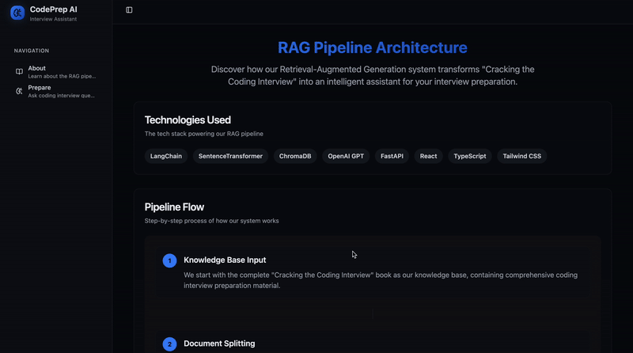

# Interview Prep

## 📖 Overview
Interview Prep is a Retrieval-Augmented Generation (RAG) system designed to be your AI-powered study buddy for technical coding interviews. By default, it's loaded with the knowledge from "Cracking the Coding Interview," allowing you to ask natural language questions and receive precise, context-aware answers. The architecture is modular and can be easily adapted for any other document-based knowledge base.

## ✨ Features
- **Intelligent Q&A:** Query the "Cracking the Coding Interview" book using natural language.
- **Sample Questions & Tips:** The frontend provides example questions and search guidance to help you get started.
- **Modern UI:** A clean, user-friendly interface built for an optimal study experience.
- **Modular Backend:** A flexible RAG pipeline that can be customized to work with other PDFs or text documents.

## 🏗️ Architecture & How It Works
This project is split into two main components:

### Backend (`/backend`): A Python-based RAG pipeline.
1.  **Data Ingestion (`data_ingestion.py`):**
    - Ingests the "Cracking the Coding Interview" PDF.
    - Splits the text into chunks using **Sentence Transformers** for optimal semantic meaning.
    - Creates embeddings for these chunks and stores them in a **ChromaDB** vector store for efficient similarity search.

2.  **Retrieval & Generation (`retriever_file.py`):**
    - Takes a user's query and finds the most relevant text chunks from the vector store.
    - Combines this context with the original query and sends it to the **OpenAI LLM** to generate a coherent and accurate answer.

3.  **API Layer (`main.py`):**
    - Provides a clean API endpoint for the frontend to submit questions.
    - Calls the retriever and returns the generated result.

### Frontend (`/frontend`): A modern web application.
- **About Page (`About.tsx`):** Explains the RAG pipeline and how the application works.
- **Prepare Page (`Prepare.tsx`):** Provides an input bar for queries, sample questions, search tips, and displays the generated results from the backend API.

## 🔧 Customization: Using Your Own Knowledge Base
This RAG pipeline is generic and not limited to one book. You can easily use it with any PDF or text-based knowledge base.

**To use your own document:**
1.  Place your PDF or text file in the designated data directory (e.g., `backend/data/`).
2.  Update the file path in `data_ingestion.py` to point to your new document.
3.  (Optional) Adjust the chunking logic (e.g., chunk size) in `data_ingestion.py` to best suit your document's structure.
4.  Run the data ingestion script again to populate the vector store with your custom data:
    ```bash
    cd backend
    python data_ingestion.py
    ```
The retriever and API will now use your new knowledge base.

## 🚀 Getting Started

### Prerequisites
- Python 3.10+
- Node.js (version 18 or above)
- An [OpenAI API key](https://platform.openai.com/api-keys)

### Installation & Setup

1.  **Clone the repository**
    ```bash
    git clone <your-repo-url>
    cd interview-prep
    ```

2.  **Setup Backend**
    ```bash
    cd backend
    # Create a virtual environment (recommended)
    python -m venv venv
    # Activate it on macOS/Linux:
    source venv/bin/activate
    # Or on Windows:
    # venv\Scripts\activate
    # Install Python dependencies
    pip install -r requirements.txt
    ```

3.  **Add Your API Key**
    - Create a `.env` file in the `/backend` directory.
    - Add your OpenAI API key to it:
      ```env
      OPENAI_API_KEY=your_actual_api_key_here
      ```
    *(Remember: Never commit your `.env` file to version control!)*

4.  **Run the Data Ingestion Pipeline** (First-time setup)
    ```bash
    python data_ingestion.py
    ```
    This will process the book and build the vector database.

5.  **Start the Backend Server**
    ```bash
    uvicorn main:app --reload
    ```
    The API server will now be running with hot-reload on `http://localhost:8000`. Keep this terminal open.

6.  **Setup and Start the Frontend**
    ```bash
    # Open a new terminal window and navigate to the frontend directory
    cd ../frontend
    # Install npm dependencies
    npm install
    # Start the development server
    npm run dev
    ```
    The frontend will now be running, typically on `http://localhost:3000` or the port specified in your Vite config. Open this URL in your browser.

## 📸 Screenshots
| About Page | Prepare Page |
| :---: | :---: |
|  |  |  

## 🛠️ Technology Stack
- **Backend:** Python, ChromaDB, Sentence-Transformers, OpenAI API, FastAPI, Uvicorn, python-dotenv
- **Frontend:** React, TypeScript, Vite, CSS

## 🤝 Contributing
Contributions, issues, and feature requests are welcome!